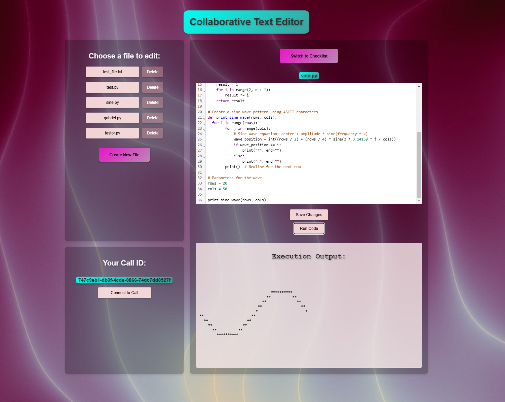
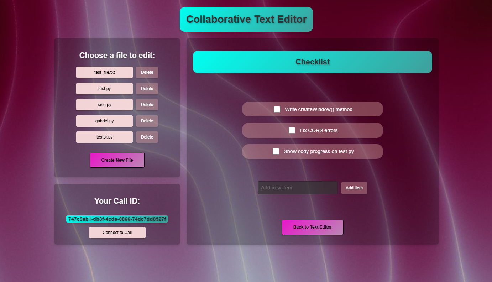

# Collaborative Text Editor WebApp (MERN Stack)

## This project is a WebApp written in the MERN Stack (MongoDB, Express.js, React.js, Node.js) that contains the following features

**Real-Time Text Editor with syntax highlighting that syncs between users in real time for collaboration**

**Real-Time Voice Chat sessions between users for collaboration**

**Built In Python Interpreter to test coding projects**

**Built In File Manager using MongoDB to store and update files**

**Built In Checklist tool to aid collaboration**

## Showcase:

**Collaborative Text Editor with Built In Code Execution**

**Built In Checklist**

## Installation guide:

Step 1: Install MongoDB + MongoDB Compass https://www.mongodb.com/try/download/community-kubernetes-operator

Step 2: Create the Database connection "mongodb://localhost:27017/collabDB" with a collection named "files"

Step 3: Clone the github repo

Step 4: In the root directory (code-portfolio/Full Stack MERN Recipe Viewer WebApp):

    npm install
    cd server
    node server.js

Step 5: In the Client Directory (code-portfolio/Full Stack MERN Recipe Viewer WebApp) (separate command prompt):

    npm install
    cd src
    npm start

Step 6: Connect to the WebApp at http://localhost:3000/

## Future Enhancements

**Create a Whiteboard tool that syncs between users** 