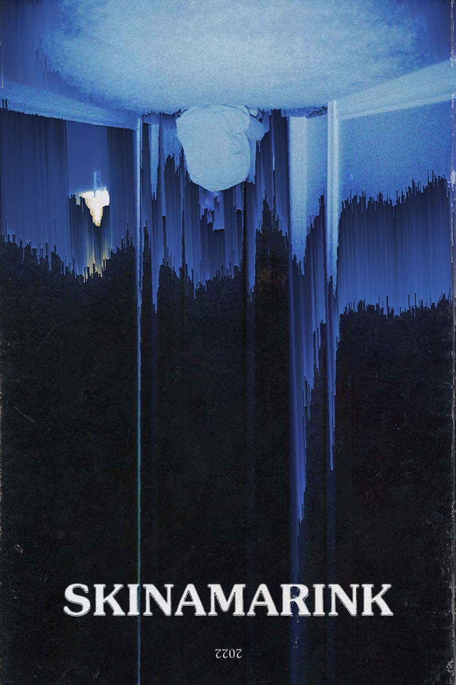

# Python Pixel Sorting WebApp

### Interactive Python Flask WebApp that leverages the Pixelsort library to enable users to apply visual effects to images and videos.

### Run with ```python app.py```
### Connet to the App at the URL specified by Flask in the terminal


## Examples:



<video width="600" controls>
  <source src="concert_mask.mp4" type="video/mp4">
  Your browser does not support the video tag.
</video>