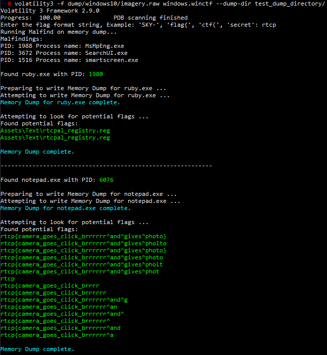
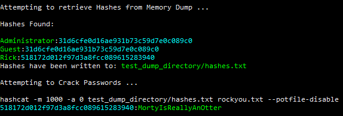
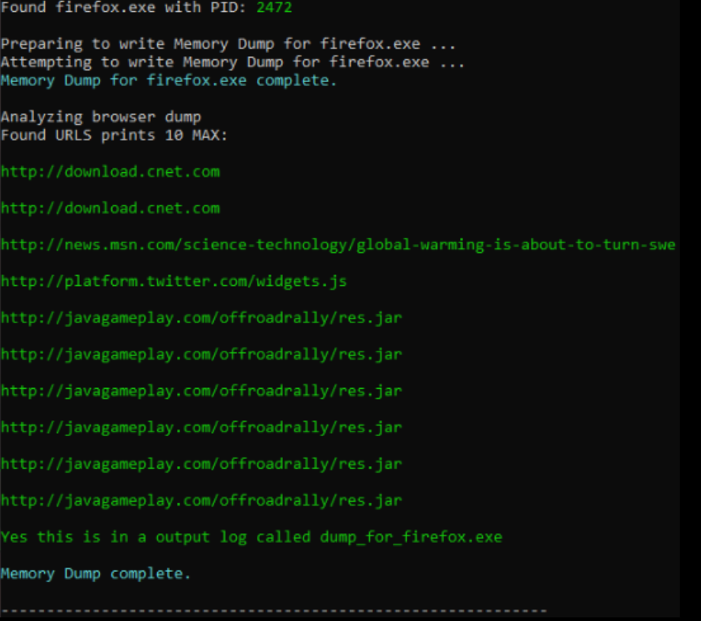

# volatility-plugin

## Volatility Plugin for CYB4890

### Volatility 3 Framework 2.9.0 winctf plugin for Windows

**Authors: Liam Dumbell, Joshua Hartzfeld, Logan Klaproth**

Place Inside: volatility3/volatility3/framework/plugins/windows

### Features:

**Automatic Suspicious Process Detection using windows.malfind**

**Automatic process detection and memory dumping with built in flag detection using custom flag formats. Works with both little endian and big endian memory formats.**

**Automatic NTLM (windows) hash detection using windows.hashdump and decryption via Hashcat instance run as a subprocess**

**Automation of the detection and dumping of commonly used browsers (firefox, MicrosoftEdge, chrome)**

# Example Output:

## Test Dumps:
Test Flag Finder functionality (try flag 'rtcp'): imagery.raw (Windows10): https://drive.google.com/file/d/1y4sfIaUrAOK0wXiDZXiOI-q2SYs6M--g/view

Test Password Cracking functionality (try flag 'hackflags'): OtterCTF.vmem (Windows 10): https://mega.nz/#!sh8wmCIL!b4tpech4wzc3QQ6YgQ2uZnOmctRZ2duQxDqxbkWYipQ

Test Browser Memory Analysis functionality: voltest.dmp (Windows 10): http://www.superponible.com/volatility/voltest.zip

## Future improvements:

Implement AutoVolatility.py plugin to run analysis methods and memory dump processes simultaneously

Improve web analysis to include Cookie data